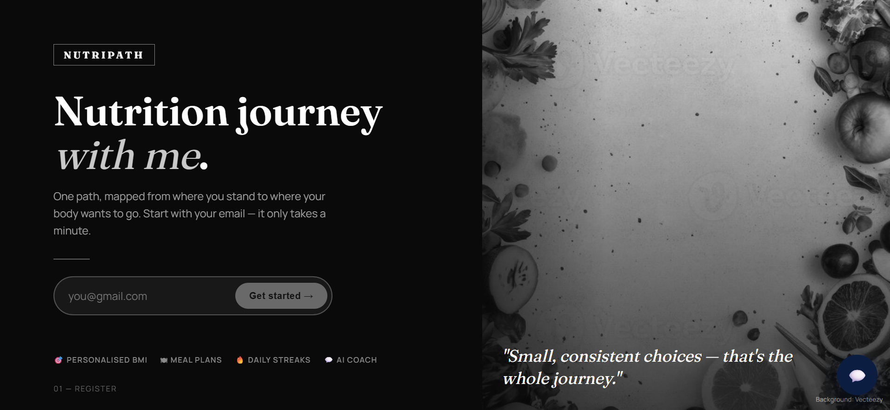
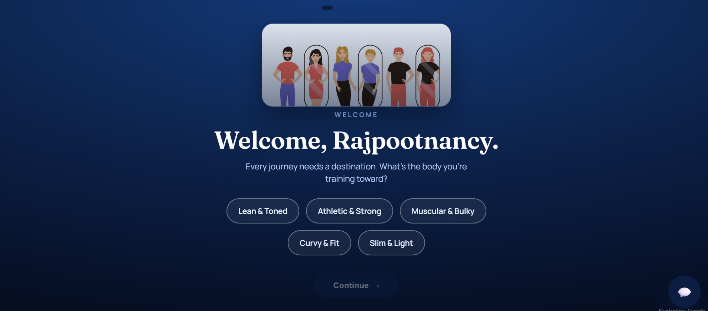
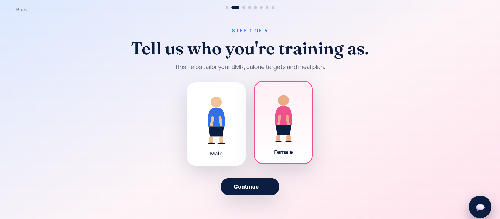
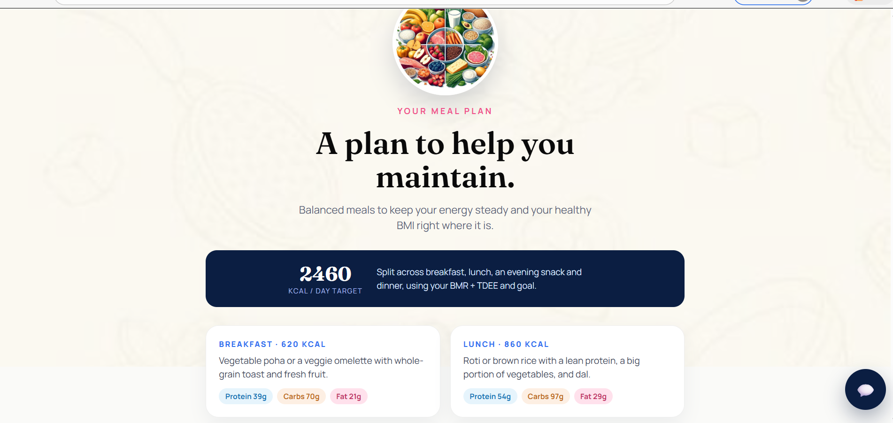
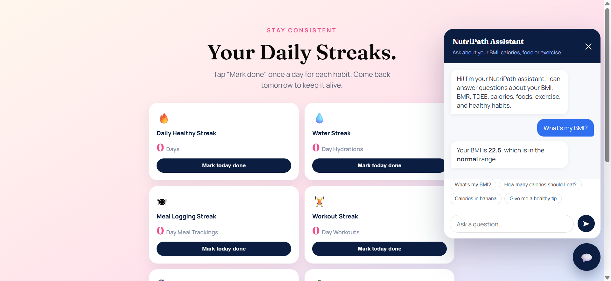

## 📖 Overview

**NutriPath** helps users plan and manage their health and fitness goals through a step-by-step interactive workflow. By completing a brief assessment, the application calculates key health metrics—including Body Mass Index (BMI), Basal Metabolic Rate (BMR), and Total Daily Energy Expenditure (TDEE)—and uses them to suggest daily caloric targets, meal plans, exercise ideas, and habit tracking.

---

## 📸 Screenshots

### 🏠 Landing Page


### 🎯 Personalised Onboarding


### 📊 Activity & BMI Setup


### 🍱 Meal Planning


### 🔥 Streak Tracker & Assistant


---

## ✨ Key Features

| Feature | Category | Description |
| :--- | :--- | :--- |
| **📋 Guided Assessment** | Assessment | Multi-step form collecting essential details such as gender, age, weight, height, and activity level. |
| **🎚️ Interactive Controls** | UI / UX | Range sliders and input controls providing real-time visual feedback during data entry. |
| **📊 Health Metrics Calculation** | Calculations | Client-side calculations using standard formulas to determine **BMI**, **BMR**, and **TDEE**. |
| **🍎 Macro & Meal Planning** | Nutrition | Recommended daily caloric targets with macronutrient breakdowns (Protein, Carbs, Fats) and practical meal ideas. |
| **🏋️ Workout Suggestions** | Fitness | Recommended physical exercises with target durations and estimated calorie burn values. |
| **🔥 Habit & Streak Tracker** | Tracking | Interactive daily tracker for logging hydration 💧, meals 🥗, and workouts 🏃. |
| **💬 Embedded Nutrition Chatbot** | Support | Built-in chatbot providing quick, rule-based responses to common questions about meals, calories, and workouts. |

---

## 🛠️ Tech Stack & Web Resources

NutriPath is built with standard front-end web technologies and runs directly in the browser:

- **Frontend Structure:** HTML5
- **Styling:** CSS3 (Flexbox/Grid layout, custom responsive components)
- **Application Logic:** Vanilla JavaScript (ES6+)
- **Typography:** Google Fonts (*Fraunces*, *Manrope*)

---

## 🔄 Application Workflow

```text
┌──────────────────────────────────────────────┐
│       1. Account Setup & Basic Details       │
└──────────────────────┬───────────────────────┘
                       │
                       ▼
┌──────────────────────────────────────────────┐
│       2. Interactive Metrics Input           │
│   (Age, Height, Weight, Activity Level)      │
└──────────────────────┬───────────────────────┘
                       │
                       ▼
┌──────────────────────────────────────────────┐
│       3. Health Calculation Phase            │
│       (Computes BMI, BMR, and TDEE)          │
└──────────────────────┬───────────────────────┘
                       │
                       ▼
┌──────────────────────────────────────────────┐
│       4. Health Metrics Dashboard            │
│ (BMI Category Status & Daily Energy Targets) │
└──────────────────────┬───────────────────────┘
                       │
                       ▼
┌──────────────────────────────────────────────┐
│ 5. Personalized Recommendations & Tracking   │
│ (Meal Plans, Exercise Guidance & Habit Logs) │
└──────────────────────────────────────────────┘
🚀 Getting Started
Prerequisites
NutriPath runs natively in any modern web browser without needing additional dependencies, node modules, or build steps.

Installation & Execution
Clone the Repository:

Bash
git clone [https://github.com/Nancyrajput2003/Nutripath.git](https://github.com/Nancyrajput2003/Nutripath.git)
Navigate to Project Directory:

Bash
cd Nutripath
Launch the Application:
Open index.html directly in your preferred web browser:

macOS: open index.html

Windows: start index.html

Linux: xdg-open index.html

💡 User Guide
Initial Onboarding: Complete the basic details step to begin your assessment.

Metrics Input: Use the interactive sliders and controls to input age, weight, height, and activity level.

Review Metrics: View calculated results for BMI classification, baseline BMR, and daily TDEE targets.

Explore Suggestions: Browse recommended daily meal options, macro splits, and exercise targets.

Track Daily Habits: Log your daily nutrition, hydration, and workout progress to maintain your streak.

Use the Chatbot: Access the bottom-corner assistant for quick answers regarding meal ideas and training guidelines.
